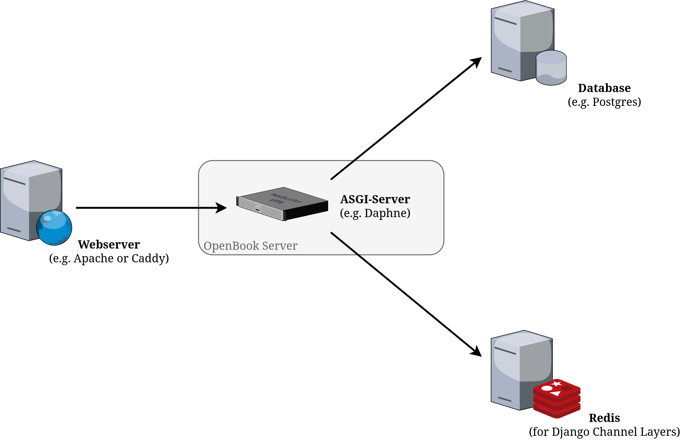

Installation Notes for Administrators
=====================================

1. [System Overview](#system-overview)
1. [Installation Notes (xmlsec1, ltdl)](#installation-notes-xmlsec1-ltdl)
1. [Local Settings](#local-settings)
1. [Web Server](#web-server)
1. [Docker Compose](#docker-compose)
1. [Periodic Jobs](#periodic-jobs)
1. [Backups](#backups)
1. [SAML SSO and Social Login](#saml-sso-and-social-login)

System Overview
---------------

Regarding deployment this is a pretty standard Django project. Please see the
[Django Documentation](https://docs.djangoproject.com/en/5.0/#the-development-process)
for all details. Below is a quick summary including a few notable considerations.



* __Front Webserver:__ This is not strictly necessary but usually you want one for
  the following tasks:

   * TLS termination
   * Serving of static files
   * Serving of uploaded media files
   * Reverse proxy to the application

  The last point is kind-of optional if you have multiple domains like https://example.com,
  https://static.example.com and https://media.example.com pointing to different machines.
  A more basic setup hosts everything on one machine and uses the front webserver to host
  static and media files and forward all other requests to the Django application.

  Almost any production webserver will do. For many people, [Apache http](https://httpd.apache.org)
  is the battle-proven de-facto standard. But [Caddy](https://caddyserver.com/) is a nice and
  modern alternative with very little configuration.

  When using the webserver as a reverse-proxy in front of the application API, make sure that
  the authorization HTTP headers are passed through. From the
  [Django Rest Framework Documentation](https://www.django-rest-framework.org/api-guide/authentication/#apache-mod_wsgi-specific-configuration):

  > Note that if deploying to Apache using mod_wsgi, the authorization header is not passed through
  > to a WSGI application by default, as it is assumed that authentication will be handled by Apache,
  > rather than at an application level.
  >
  > If you are deploying to Apache, and using any non-session based authentication, you will need to
  > explicitly configure mod_wsgi to pass the required headers through to the application. This can be
  > done by specifying the WSGIPassAuthorization directive in the appropriate context and setting it
  > to 'On'.
  >
  > ```
  > # this can go in either server config, virtual host, directory or .htaccess
  > WSGIPassAuthorization On
  > ```

* __ASGI Server:__ The heart of the web application is the ASGI server running the Python sources.
  For Django-based projects this is usually [Daphne](https://github.com/django/daphne). Sine
  Daphne is already a dependency, in practice this simply means:

  ```sh
  daphne -p 8000 -b 0.0.0.0 openbook.asgi:application 
  ```

* __Redis:__ This is not yet needed. But in future we will likely rely on websockets for real-time
  communication with the backend. Then Djange Channels must be set up using a so called
  [Channel Layer](https://channels.readthedocs.io/en/stable/topics/channel_layers.html) as a
  communication backend. Typically [Redis](https://redis.io) is used for this. Our Django project
  already contains the necessary configuration, expecting Redis to listen on `localhost:6379`.
  Of course, this setting can be overwritten in the local settings file.
  
* __Database:__ A database like [MariaDB](https://mariadb.org/) or [Postgres](https://www.postgresql.org/)
  is needed for persistent storage. See the [Django Documentation](https://docs.djangoproject.com/en/5.0/ref/databases/)
  for all supported databases. Make sure to pip install the correct database driver and adopt the local
  settings file accordingly.

See the provided Docker and Docker Compose files for a working example. Also note, that despite the image,
all components are scalable by default. If your front server can load balance to multiple backends, you
can easily start multiple backend instances to fully utilize the hardware. It is up to you whether to
distribute the components to individual machines/VMs/containers or not. Even a basic setup on a single
machine can go very far. To keep things simple we recommend to start small and only scale-up when the
need arises.

Installation Notes (xmlsec1, ltdl)
----------------------------------

Before installing the Python dependencies with `poetry install` make sure the following packages are
installed on your system. On Linux you can use your local package manager like `apt` or `dfn` for this.

 * `xmlsec1` (with development headers)
 * `libtool-ltdl` (with development headers)

These are needed for the SAML integration. If you cannot install these packages and don't plan to use
SAML anyway (e.g. to integrate in your school/university's identity management) you can manually edit
`pyproject.yml` and remove `"saml"` from the `django-allauth` dependency, instead.

If the server crashes with `xmlsec.InternalError: (-1, 'lxml & xmlsec libxml2 library version mismatch')`,
this could mean:

* The system has multiple versions of `libxml2` installed (unlikely).
* `lxml` and/or `xmlsec` were compiled against different versions of `libxml2`.
* You upgraded/downgraded `libxml2`, `lxml`, or `xmlsec` without rebuilding the others.
* Poetry installed binary wheels that are incompatible with your system libraries.

The following command should hopefuly fix it:

```sh
poetry run pip uninstall lxml xmlsec -y && poetry run pip install --no-binary=:all: lxml xmlsec
```

Local Settings
--------------

Settings is probably the one part of Django where you really feel its old age. By default there is
no way standard way to separate local deployment-specific settings (e.g. database credentials) from
local development settings. We are using a simple approach here:

* File `settings.py`: Contains the base settings, plus everything needed for local development.
* File `local_settings.py`: Specific settings for deployment or a special local setup.

The file `local_settings.py` is therefor excluded from version control. There is a template file
that explains some settings that you usually want to override.

Web Server
----------

In the good old WSGI days Apache + mod_python used to be a reliable way to serve Django applications.
Since this project also uses Django Channels for websocket support, we need an ASGI-capable server, instead.
Django Channels already comes with the Daphne server. You can run it like this:

```sh
cd openbook
daphne -p 8000 -b 0.0.0.0 openbook.asgi:application
```

On your local development machine you might need to use `poetry run` to run Daphne from within the
Python environment.

When running behind a reverse proxy (e.g. because you host multiple apps and/or sites on the same
machine), you usually want to bind to localhost only:

```sh
cd openbook
daphne -p 8000 openbook.asgi:application
```

If you are still looking for a good reverse proxy (or webserver in general), try out [Caddy](https://caddyserver.com/).
Give it a try.

Oh, and don't forget to serve static and uploaded media files. By default they live in the `_static/` and
`_media/` directories of each Django project. But you can override the filesystem path and the final web
URL in your `local_settings.py`. Once that is done you need to "collect" the static files with the following
command:

```sh
python ./manage.py collectstatic
```

Docker Compose
--------------

The [_docker](_docker) directory contains a working example configuration for Docker Compose.
You can use it to test a full deployment build on your local machine and as a template for your
own deployment. The following commands will be helpful:

* `docker compose build` - Build docker images
* `docker compose up` - Start all services in foreground (end with CTRL+C)
* `docker compose up -d` - Start all services in background
* `docker compose down` - Stop all services, either in foreground or background
* `docker exec -it docker-openbook-server-1 sh` - Open a shell on the OpenBook Server

The following services are defined:

* `postgres` (container `docker-postgres-1`): Persistent database
* `redis` (container `docker-redis-1`): Key/value store for asynchronous processes
* `openbook-server` (container `docker-openbook-server-1`): The main server
* `webserver` (container `docker-webserver-1`): Frontend webserver

As of today there is no official docker image on Docker Hub. Therefor the directory contains a
Dockerfile that will be built on demand. For the time being the recommendation is to pull the
source code from GitHub, copy the `_docker` directory to a new location outside the git tree
and adapt it to your needs.

Get in touch with us, if you like to work on an official Docker image, once the platform is
sufficiently mature enough.

Periodic Jobs
=============

There are a few Django management commands that should be periodically called to keep the database clean.
They are usually invoked with:

```bash
src$ ./manage.py command --options
```

The most important ones are:

| **Management Command**                 | **Description**                                                       |
|----------------------------------------|-----------------------------------------------------------------------|
| `clearsessions`                        | Clean out expired sessions                                            |
| `remove_stale_contenttypes --no-input` | Remove stale content types when models are removed from the codebase. |

Backups
=======

This project includes [Django DBBackups](https://django-dbbackup.readthedocs.io/) for easy database and
media files backups. The backups can be saved to local files or remote storage like AWS S3 or Dropbox.
See the linked documentation for configuration details. Here's a quick summary:

| **Management Command** | **Description**                              |
|------------------------|----------------------------------------------|
| `dbbackup`             | Create new database backup                   |
| `dbrestore`            | Import database backup (into empty database) |
| `listbackups`          | List available backups                       |
| `mediabackup`          | Backup media files                           |
| `mediarestore`         | Import backedup media files                  |

Note, to avoid errors the database should be empty when backups are imported.

The Django DBBackups documentation recommends for larger installations to setup a database replica on
the database level and use the replica to create the backups, to avoid performance impacts.

SAML SSO and Social Login
=========================

This project uses [django-allauth\[saml\]](https://docs.allauth.org/en/latest/socialaccount/providers/saml.html)
to connect with SAML identity providers. Additionaly it is possible to allow local user registration
(per-application silo with built-in user management) and social authentication using Google, Microsoft
and many other providers. A few hints are contained in the `local-settings.py` file. But please read
the [django-allauth Documentation](https://docs.allauth.org/en/latest/index.html) for full details.

When you load the initial test data, a dummy SAML provider based on [mocksaml.com](https://mocksaml.com)
by Ory will already be configured. Please check [localhost:8887](http://localhost:8887) for the
account verification e-mail to fully test the sign-up/login flow. You can sign-up with two different
e-mail domains, which will be used to determine the user group of the new user:

 * `example.com`: User group `student`
 * `example.org`: User group `teacher`

Please consider the following information from the
[Allauth SAML Guidelines](https://docs.allauth.org/en/latest/socialaccount/providers/saml.html#guidelines):

> * Most SAML IdPs require TLS (formerly SSL) to be used, making testing with runserver challenging.
> Make sure to configure Django to use HTTPS. (Note: Mock SAML works fine with plain HTTP).
>
> * If using a reverse proxy, be sure to set Django settings `USE_X_FORWARDED_HOST = True`,
> `SECURE_PROXY_SSL_HEADER = ('HTTP_X_FORWARDED_PROTO', 'https')`, and `SECURE_SSL_REDIRECT = True`.
> In your web server’s reverse proxy configuration, ensure that you set request headers
> `X_FORWARDED_PROTO 'https' env=HTTPS` and `X-Forwarded-Ssl on`.
>
> * Cookies must also be secure; ensure that `CSRF_COOKIE_DOMAIN` and `SESSION_COOKIE_DOMAIN`
> are set to `yourdomain.com`, and that `CSRF_COOKIE_SECURE` and `SESSION_COOKIE_SECURE` are
> `True` in your Django settings.
>
> * Test with your browser in privacy / incognito mode, check your developer console to ensure
> that cookies are being set correctly, and use a tool like SAML Tracer (Firefox / Chromium)
> to inspect the SAML messages being exchanged. SAML Tracer is also useful for looking up the
> IdP SAML values to map to uid, email, and email_verified in the attribute_mapping configuration.
