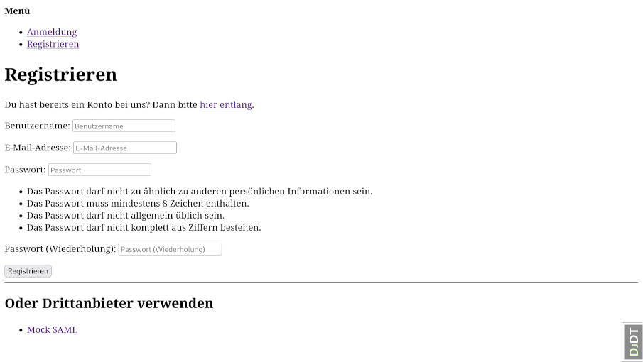
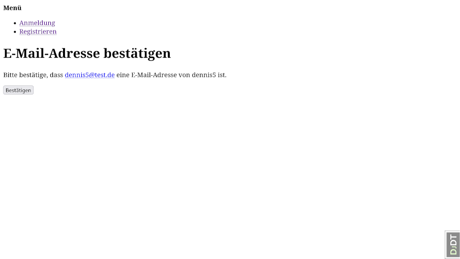
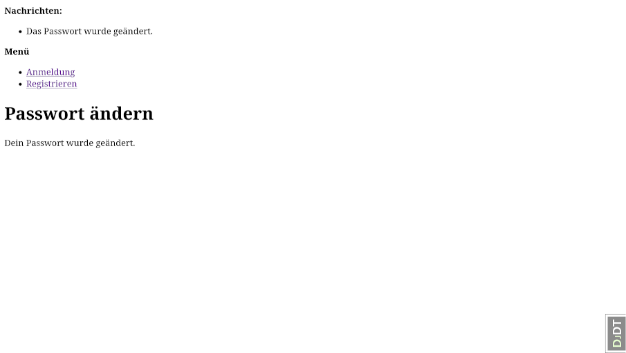

Basic Account Management
========================

This document described the basic account management processes like signup
or password reset.

1. [Signup for a new local account](#signup-for-a-new-local-account)
    1. [Signup form](#signup-form)
    1. [Confirmation sent](#confirmation-sent)
    1. [Confirm e-mail address](#confirm-e-mail-address)
1. [Reset forgotten password](#reset-forgotten-password)
    1. [Enter e-mail address](#enter-e-mail-address)
    1. [Password reset code sent](#password-reset-code-sent)
    1. [Enter new password](#enter-new-password)
    1. [Password reset confirmed](#password-reset-confirmed)

Signup for a new local account
------------------------------

### Signup form

* URL: `/accounts/signup/`
* Should show a message for invalid data. But default template simply rerenders without message?

### Confirmation sent

* URL: `/accounts/confirm-email/`
* This appears after successful signup when the confirmation mail has been sent.

### Confirm e-mail address

* URL: `/accounts/confirm-email/Mw:1w6v4v:Ns2nPgP099lhnDlhhFcbGSmUeC_pvadjWpL9wQgntak/`
* This is the link from the conformation mail. It shows the following screen.

TODO: API Calls

Reset forgotten password
------------------------

### Enter e-mail address

* URL: `/accounts/password/reset/`

### Password reset code sent

* URL: `/accounts/password/reset/done/`

### Enter new password

* URL: `http://localhost:8000/accounts/password/reset/key/3-d67wfn-a143457b77188c729666b544a75b7ef7/`
* This is the link from the reset password mail. It shows the following screen.
* Shows additional messages at the top, when an invalid password is chosen.

### Password reset confirmed

* URL: `/accounts/password/reset/key/done/`

TODO: API Calls