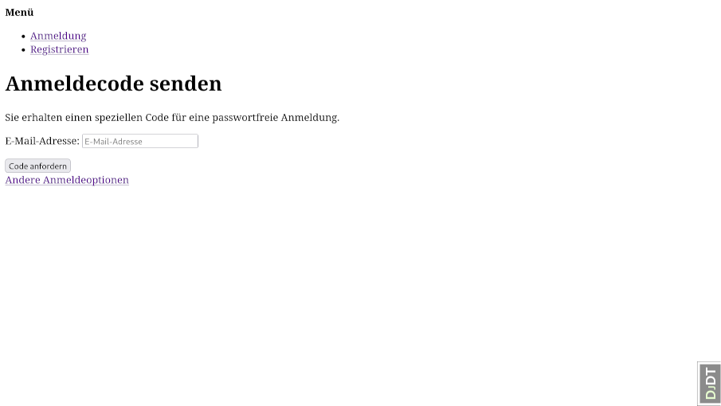
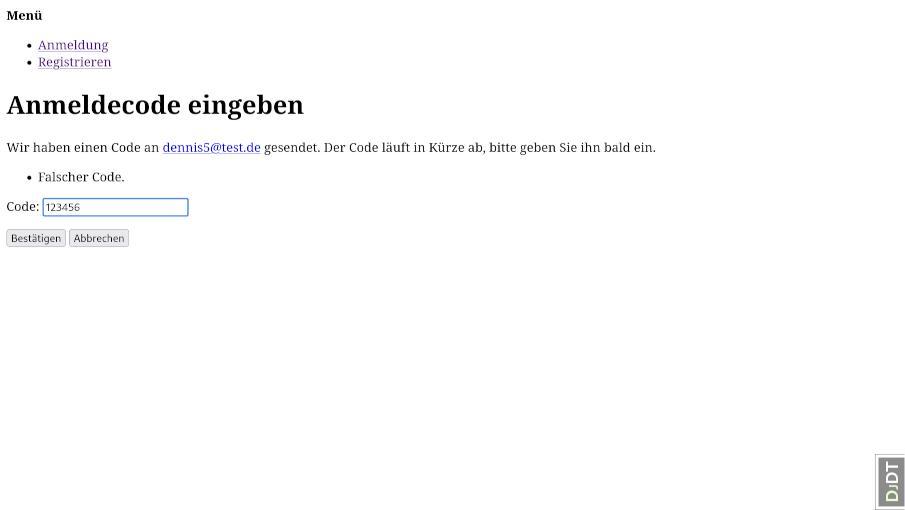
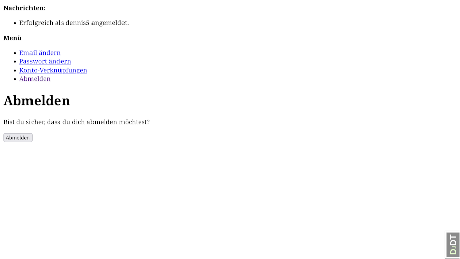

1. [Login with local account](#login-with-local-account)
1. [Login via e-mail one-time code](#login-via-e-mail-one-time-code)
    1. [Request code](#request-code)
    1. [Enter code](#enter-code)
1. [Login via SAML-based identity provider](#login-via-saml-based-identity-provider)
    1. [Begin flow](#begin-flow)
    1. [IdP login form](#idp-login-form)
    1. [Confirm e-mail](#confirm-e-mail)
1. [Signup for a new local account](#signup-for-a-new-local-account)
    1. [Signup form](#signup-form)
    1. [Confirmation sent](#confirmation-sent)
    1. [Confirm e-mail address](#confirm-e-mail-address)
1. [Reset forgotten password](#reset-forgotten-password)
    1. [Enter e-mail address](#enter-e-mail-address)
    1. [Password reset code sent](#password-reset-code-sent)
    1. [Enter new password](#enter-new-password)
    1. [Password reset confirmed](#password-reset-confirmed)
1. [Logout](#logout)


Login with local account
------------------------

* URL: `/accounts/login/?next=%2Fadmin%2F`
* The `next` parameter contains the path to redirect to after successful login.
* Should show a message for invalid data. But default template simply rerenders without message?


__API: Get Configuration__

```http
GET /auth-api/browser/v1/config HTTP/1.1
Host: localhost:8000
```

Status Code 200:

```json
{
  "status": 200,
  "data": {
    "account": {
      "login_methods": [
        "username"
      ],
      "is_open_for_signup": true,
      "email_verification_by_code_enabled": false,
      "login_by_code_enabled": true,
      "password_reset_by_code_enabled": false,
      "authentication_method": "username"
    },
    "socialaccount": {
      "providers": [
        {
          "id": "urn:mocksaml.com",
          "name": "Mock SAML IdP",
          "flows": [
            "provider_redirect"
          ]
        }
      ]
    }
  }
}
```

__API: Get Authentication Status__

This should be called on application start-up to check, if the user is already logged in
and get the username to display. It may be called later to find out, if the user is still
logged in. To keep bandwidth low, it should be called:

1. When the SPA starts
1. When another API call fails
1. In a timer every five minutes
    - Site-wide admin setting for the interval
    - Site-wide admin setting to disable the timer (intervall = 0)

```http
GET /auth-api/browser/v1/auth/session HTTP/1.1
Host: localhost:8000
```

Status Code 401: Most API requests give this response, when not logged in

```json
{
  "status": 401,
  "data": {
    "flows": [
      {
        "id": "login"
      },
      {
        "id": "login_by_code"
      },
      {
        "id": "signup"
      },
      {
        "id": "provider_redirect",
        "providers": [
          "urn:mocksaml.com"
        ]
      }
    ]
  },
  "meta": {
    "is_authenticated": false
  }
}
```

Status Code 200: When logged in

```json
{
  "status": 200,
  "data": {
    "user": {
      "id": 1,
      "display": "dennis",
      "email": "dennis@windows3.de",
      "has_usable_password": true,
      "username": "dennis"
    },
    "methods": [
      {
        "method": "password",
        "at": 1774874642.713197,
        "username": "dennis"
      }
    ]
  },
  "meta": {
    "is_authenticated": true
  }
}
```

__API: Login with username and password___

```http
POST /auth-api/browser/v1/auth/login HTTP/1.1
Origin: http://localhost:8000
X-Csrftoken: GLoSq53DnTfY99cwkRIE3PS08qA0OJip
Content-Type: application/json
Host: localhost:8000
Content-Length: 60

{
  "username": "Unknown user",
  "password": "TopSecret!"
}
```

Status code 400: Invalid username or password

```json
{
  "status": 400,
  "errors": [
    {
      "message": "The username and/or password you specified are not correct.",
      "code": "username_password_mismatch",
      "param": "password"
    }
  ]
}
```

Status code 200: Login successful

```json
{
  "status": 200,
  "data": {
    "user": {
      "id": 1,
      "display": "dennis",
      "email": "dennis@windows3.de",
      "has_usable_password": true,
      "username": "dennis"
    },
    "methods": [
      {
        "method": "password",
        "at": 1774874642.713197,
        "username": "dennis"
      }
    ]
  },
  "meta": {
    "is_authenticated": true
  }
}
```

Login via e-mail one-time code
------------------------------

### Request code

* URL: `/accounts/login/code/`



### Enter code

* URL: `/accounts/login/code/confirm/`
* Show a message when an invalid code is entered.



Login via SAML-based identity provider
--------------------------------------

### Begin flow

* URL: `/accounts/saml/mocksaml/login/?process=login`
* The SAML provider has already been chosen before starting the process.
* Clicking the button redirects the client to the IdP login page.


### IdP login form


### Confirm e-mail

* URLs: `/accounts/confirm-email/` and `/accounts/confirm-email/.../`
* After the first login, the e-mail address must be verified.
* This is the exact same flow as when signing up for a local account (see below).


Signup for a new local account
------------------------------

### Signup form

* URL: `/accounts/signup/`
* Should show a message for invalid data. But default template simply rerenders without message?


### Confirmation sent

* URL: `/accounts/confirm-email/`
* This appears after successful signup when the confirmation mail has been sent.


### Confirm e-mail address

* URL: `/accounts/confirm-email/Mw:1w6v4v:Ns2nPgP099lhnDlhhFcbGSmUeC_pvadjWpL9wQgntak/`
* This is the link from the conformation mail. It shows the following screen.


Reset forgotten password
------------------------

### Enter e-mail address

* URL: `/accounts/password/reset/`


### Password reset code sent

* URL: `/accounts/password/reset/done/`


### Enter new password

* URL: `http://localhost:8000/accounts/password/reset/key/3-d67wfn-a143457b77188c729666b544a75b7ef7/`
* This is the link from the reset password mail. It shows the following screen.
* Shows additional messages at the top, when an invalid password is chosen.


### Password reset confirmed

* URL: `/accounts/password/reset/key/done/`


Logout
------

* URL: `/accounts/logout/`
* Redirects to `/` after logout.



__API: Logout__

```http
DELETE /auth-api/browser/v1/auth/session HTTP/1.1
Origin: http://localhost:8000
X-Csrftoken: rgSxJU7NYCmOzV6c03pGQcgWLsKYMlTf
Host: localhost:8000
```

Status code 401: Successfully logged out.

Note: The response is always the same, no matter if the user was logged in before.

```json
{
  "status": 401,
  "data": {
    "flows": [
      {
        "id": "login"
      },
      {
        "id": "login_by_code"
      },
      {
        "id": "signup"
      },
      {
        "id": "provider_redirect",
        "providers": [
          "urn:mocksaml.com"
        ]
      }
    ]
  },
  "meta": {
    "is_authenticated": false
  }
}
```