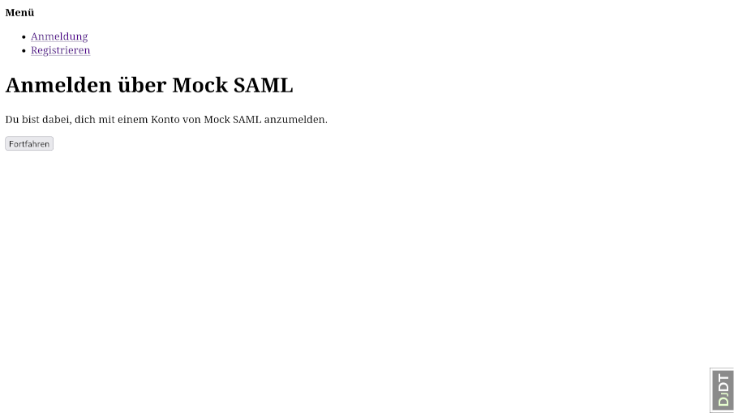
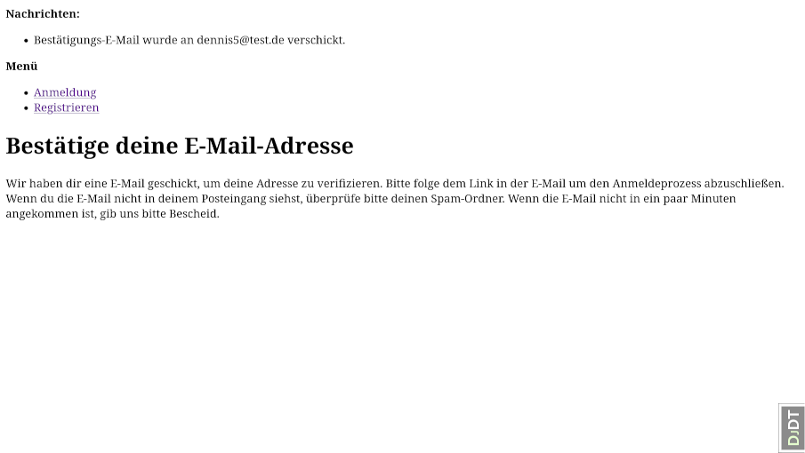

Django Allauth Flows
====================

This file documents the screen flows used in our application, that are implemented via
Django Allauth. The purpose is to document the screens that need to be implemented in
the frontend SPA, so that all auth related functions are supported. Currently these are:

1. [Login with local account](#login-with-local-account)
1. [Login via e-mail one-time code](#login-via-e-mail-one-time-code)
    1. [Request code](#request-code)
    1. [Enter code](#enter-code)
1. [Login via SAML-based identity provider](#login-via-saml-based-identity-provider)
    1. [Begin flow](#begin-flow)
    1. [IdP login form](#idp-login-form)
    1. [Confirm e-mail](#confirm-e-mail)
1. [Signup for a new local account](#signup-for-a-new-local-account)
    1. [Signup form](#signup-form)
    1. [Confirmation sent](#confirmation-sent)
    1. [Confirm e-mail address](#confirm-e-mail-address)
1. [Reset forgotten password](#reset-forgotten-password)
    1. [Enter e-mail address](#enter-e-mail-address)
    1. [Password reset code sent](#password-reset-code-sent)
    1. [Enter new password](#enter-new-password)
    1. [Password reset confirmed](#password-reset-confirmed)
1. [Logout](#logout)

Login with local account
------------------------

* URL: `/accounts/login/?next=%2Fadmin%2F`
* The `next` parameter contains the path to redirect to after successful login.
* Should show a message for invalid data. But default template simply rerenders without message?

Login via e-mail one-time code
------------------------------

### Request code

* URL: `/accounts/login/code/`

### Enter code

* URL: `/accounts/login/code/confirm/`
* Show a message when an invalid code is entered.

Login via SAML-based identity provider
--------------------------------------

### Begin flow

* URL: `/accounts/saml/mocksaml/login/?process=login`
* The SAML provider has already been chosen before starting the process.
* Clicking the button redirects the client to the IdP login page.

### IdP login form

### Confirm e-mail

* URLs: `/accounts/confirm-email/` and `/accounts/confirm-email/.../`
* After the first login, the e-mail address must be verified.
* This is the exact same flow as when signing up for a local account (see below).

Signup for a new local account
------------------------------

### Signup form

* URL: `/accounts/signup/`
* Should show a message for invalid data. But default template simply rerenders without message?

### Confirmation sent

* URL: `/accounts/confirm-email/`
* This appears after successful signup when the confirmation mail has been sent.

### Confirm e-mail address

* URL: `/accounts/confirm-email/Mw:1w6v4v:Ns2nPgP099lhnDlhhFcbGSmUeC_pvadjWpL9wQgntak/`
* This is the link from the conformation mail. It shows the following screen.

Reset forgotten password
------------------------

### Enter e-mail address

* URL: `/accounts/password/reset/`

### Password reset code sent

* URL: `/accounts/password/reset/done/`

### Enter new password

* URL: `http://localhost:8000/accounts/password/reset/key/3-d67wfn-a143457b77188c729666b544a75b7ef7/`
* This is the link from the reset password mail. It shows the following screen.
* Shows additional messages at the top, when an invalid password is chosen.

### Password reset confirmed

* URL: `/accounts/password/reset/key/done/`

Logout
------

* URL: `/accounts/logout/`
* Redirects to `/` after logout.

